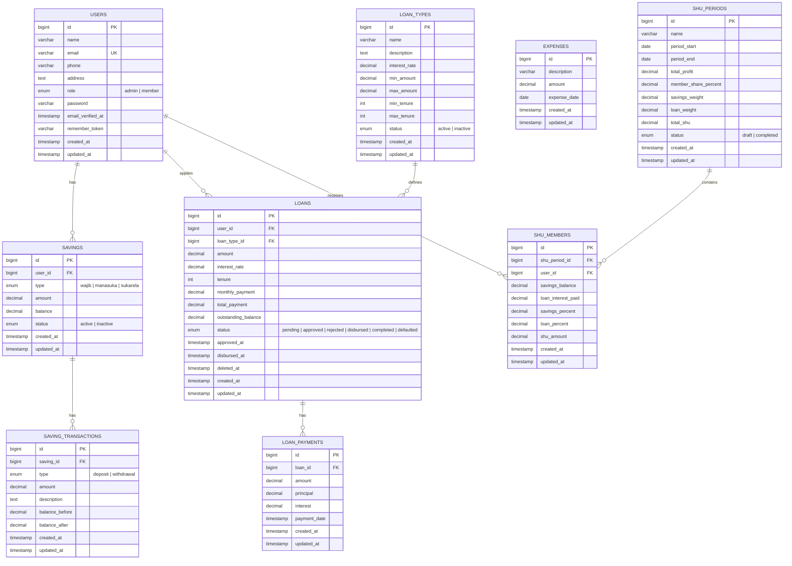

# Entity Relationship Diagram (ERD)



---

## Struktur Tabel & Relasi

### 1. `users` — Pengguna (Admin & Anggota)
Tabel utama untuk seluruh pengguna aplikasi.

| Kolom | Tipe | Keterangan |
|-------|------|------------|
| id | bigint PK | Primary key |
| name | varchar(255) | Nama lengkap |
| email | varchar(255) UNIQUE | Email (login) |
| phone | varchar(255) nullable | Nomor telepon |
| address | text nullable | Alamat |
| role | enum('admin','member') | Role pengguna |
| password | varchar(255) | Password (hash) |
| email_verified_at | timestamp nullable | Verifikasi email |

**Relasi:** One-to-Many → `savings`, `loans`, `shu_members`

---

### 2. `savings` — Rekening Simpanan
Setiap anggota bisa memiliki beberapa rekening simpanan dengan jenis berbeda.

| Kolom | Tipe | Keterangan |
|-------|------|------------|
| id | bigint PK | Primary key |
| user_id | bigint FK → users.id CASCADE | Pemilik simpanan |
| type | enum('wajib','manasuka','sukarela') | Jenis simpanan |
| amount | decimal(15,2) | Total setoran |
| balance | decimal(15,2) | Saldo saat ini |
| status | enum('active','inactive') | Status aktif |

**Relasi:** Many-to-One → `users`; One-to-Many → `saving_transactions`

---

### 3. `saving_transactions` — Transaksi Simpanan
Mencatat setiap setoran dan penarikan pada rekening simpanan.

| Kolom | Tipe | Keterangan |
|-------|------|------------|
| id | bigint PK | Primary key |
| saving_id | bigint FK → savings.id CASCADE | Rekening tujuan |
| type | enum('deposit','withdrawal') | Jenis transaksi |
| amount | decimal(15,2) | Jumlah transaksi |
| description | text nullable | Keterangan |
| balance_before | decimal(15,2) | Saldo sebelum |
| balance_after | decimal(15,2) | Saldo sesudah |

**Relasi:** Many-to-One → `savings`

---

### 4. `loan_types` — Jenis/Jasa Pinjaman
Produk pinjaman yang ditawarkan koperasi ke anggota.

| Kolom | Tipe | Keterangan |
|-------|------|------------|
| id | bigint PK | Primary key |
| name | varchar(255) | Nama produk |
| description | text nullable | Deskripsi |
| interest_rate | decimal(5,2) | Bunga (%) |
| min_amount | decimal(15,2) | Minimal pinjaman |
| max_amount | decimal(15,2) | Maksimal pinjaman |
| min_tenure | int | Minimal tenor (bulan) |
| max_tenure | int | Maksimal tenor (bulan) |
| status | enum('active','inactive') | Status aktif |

**Relasi:** One-to-Many → `loans`

---

### 5. `loans` — Pinjaman
Seluruh data pengajuan dan pencairan pinjaman anggota.

| Kolom | Tipe | Keterangan |
|-------|------|------------|
| id | bigint PK | Primary key |
| user_id | bigint FK → users.id CASCADE | Peminjam |
| loan_type_id | bigint FK → loan_types.id SET NULL | Jenis pinjaman |
| amount | decimal(15,2) | Jumlah pinjaman |
| interest_rate | decimal(5,2) | Bunga (%) |
| tenure | int | Tenor (bulan) |
| monthly_payment | decimal(15,2) | Angsuran per bulan |
| total_payment | decimal(15,2) | Total yang harus dibayar |
| outstanding_balance | decimal(15,2) | Sisa pinjaman |
| status | enum('pending','approved','rejected','disbursed','completed','defaulted') | Status |
| approved_at | timestamp nullable | Tgl disetujui |
| disbursed_at | timestamp nullable | Tgl dicairkan |
| deleted_at | timestamp nullable | Soft delete |

**Relasi:** Many-to-One → `users`; Many-to-One → `loan_types`; One-to-Many → `loan_payments`

---

### 6. `loan_payments` — Pembayaran Angsuran
Mencatat setiap pembayaran angsuran pinjaman yang dilakukan anggota.

| Kolom | Tipe | Keterangan |
|-------|------|------------|
| id | bigint PK | Primary key |
| loan_id | bigint FK → loans.id CASCADE | Pinjaman terkait |
| amount | decimal(15,2) | Jumlah dibayar |
| principal | decimal(15,2) | Porsi pokok |
| interest | decimal(15,2) | Porsi bunga |
| payment_date | timestamp | Tanggal bayar |

**Relasi:** Many-to-One → `loans`

---

### 7. `expenses` — Beban Operasional
Mencatat pengeluaran operasional koperasi (mandiri, tidak berelasi).

| Kolom | Tipe | Keterangan |
|-------|------|------------|
| id | bigint PK | Primary key |
| description | varchar(255) | Deskripsi beban |
| amount | decimal(15,2) | Jumlah |
| expense_date | date | Tanggal beban |

**Relasi:** Tabel mandiri, tidak memiliki foreign key.

---

### 8. `shu_periods` — Periode SHU
Periode pembagian Sisa Hasil Usaha.

| Kolom | Tipe | Keterangan |
|-------|------|------------|
| id | bigint PK | Primary key |
| name | varchar(255) | Nama periode |
| period_start | date | Tgl mulai |
| period_end | date | Tgl selesai |
| total_profit | decimal(15,2) | Total laba periode |
| member_share_percent | decimal(5,2) | % laba untuk anggota |
| savings_weight | decimal(5,2) | Bobot simpanan (%) |
| loan_weight | decimal(5,2) | Bobot pinjaman (%) |
| total_shu | decimal(15,2) | Total SHU dibagikan |
| status | enum('draft','completed') | Status hitung |

**Relasi:** One-to-Many → `shu_members`

---

### 9. `shu_members` — SHU per Anggota
Hasil perhitungan pembagian SHU untuk setiap anggota dalam satu periode.

| Kolom | Tipe | Keterangan |
|-------|------|------------|
| id | bigint PK | Primary key |
| shu_period_id | bigint FK → shu_periods.id CASCADE | Periode SHU |
| user_id | bigint FK → users.id CASCADE | Anggota penerima |
| savings_balance | decimal(15,2) | Saldo simpanan anggota |
| loan_interest_paid | decimal(15,2) | Bunga dibayar anggota |
| savings_percent | decimal(15,2) | % kontribusi simpanan |
| loan_percent | decimal(15,2) | % kontribusi pinjaman |
| shu_amount | decimal(15,2) | SHU diterima |

**Unique Key:** `(shu_period_id, user_id)` — satu record per anggota per periode.

**Relasi:** Many-to-One → `shu_periods`; Many-to-One → `users`

---

## Ringkasan Relasi

```
users (1) ──< (N) savings (1) ──< (N) saving_transactions
users (1) ──< (N) loans (1) ──< (N) loan_payments
loan_types (1) ──< (N) loans
shu_periods (1) ──< (N) shu_members >── (N) users
expenses (mandiri)
```
